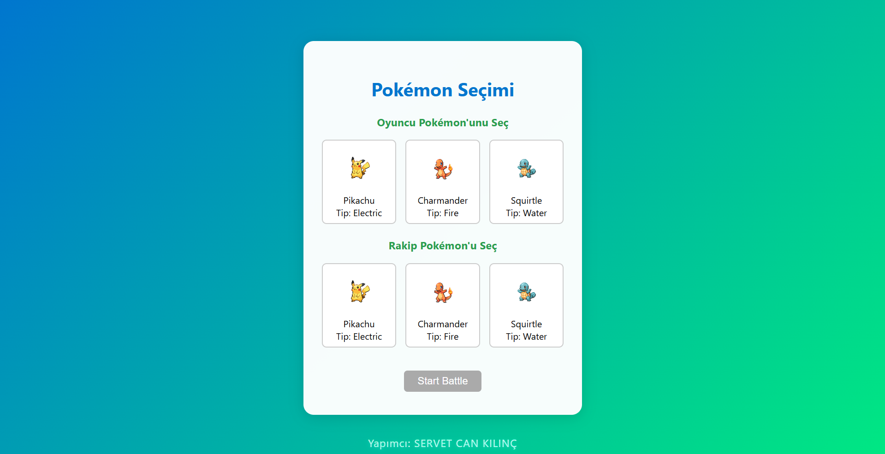
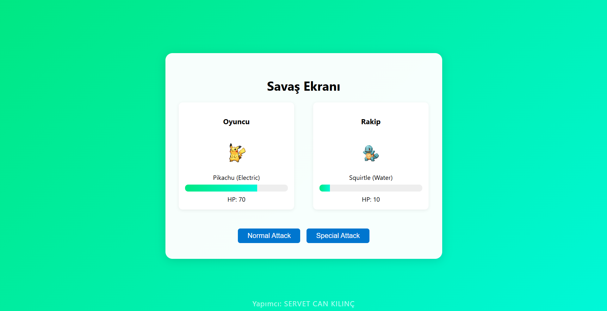
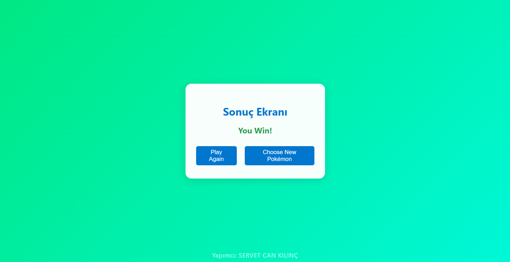
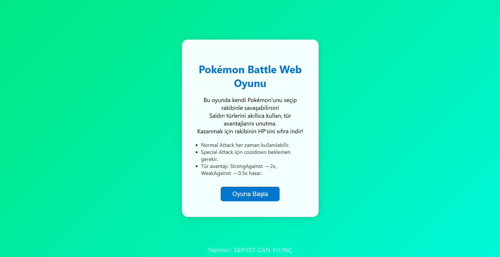

# Pokémon Battle Web Oyunu Proje Raporu

## 1. Proje Yapan Öğrenci Bilgileri
-   **Ad Soyad:** SERVET CAN KILINÇ
-   **Öğrenci Numarası:** 19240001415

## 2. Proje Özeti ve Amacı
Bu proje, modern web teknolojileri olan Vue.js 3 (frontend) ve Express.js (backend) kullanarak geliştirilmiş interaktif bir Pokémon savaş oyunudur. Projenin amacı, oyuncuların kendi Pokémon'larını seçerek rakip Pokémon'larla savaştığı, saldırı sistemleri, can barı animasyonları ve detaylı sonuç ekranı sunan web tabanlı bir deneyim sağlamaktır. Bu proje aynı zamanda hem frontend hem de backend geliştirme becerilerini bir araya getiren kapsamlı bir uygulamadır.

## 3. Kullanılan Teknolojiler
-   **Frontend:**
    -   **Vue.js 3:** Composition API ve Vite ile hızlı geliştirme.
    -   **Pinia:** Merkezi state yönetimi için (oyuncu ve rakip Pokémon durumu, savaş logları vb.).
    -   **Vue Router:** Uygulama içi sayfa yönlendirmeleri için (Karşılama, Seçim, Savaş, Sonuç, Geçmiş ekranları).
    -   **JavaScript (ES6+):** Modern JavaScript sözdizimi.
-   **Backend:**
    -   **Express.js:** RESTful API servisleri oluşturmak için hafif ve esnek Node.js framework'ü.
    -   **Node.js:** Backend uygulaması için çalışma zamanı ortamı.
    -   **File System (fs):** Veri (Pokémon ve savaş geçmişi) yönetimi için dosya okuma/yazma işlemleri.
    -   **CORS:** Çapraz kaynak isteklere izin vermek için.

## 4. Temel Gereksinimler ve İşlevler

### 4.1. Pokémon Seçimi
-   Oyuncular ve rakip Pokémon'lar, seçim ekranında listeden manuel olarak seçilebilir.
-   Seçim ekranında tüm Pokémon'lar (ID, isim, tip, görsel) listelenir.
-   Oyuncu ve rakip seçildikten sonra "Start Battle" butonu aktifleşir ve savaşı başlatır.

**Ekran Görüntüsü - Pokémon Seçim Ekranı**



### 4.2. Savaş Ekranı
-   Oyuncu ve rakip Pokémon'ların isimleri, tipleri, görselleri ve anlık HP değerleri gösterilir.
-   HP barları yüzde oranlıdır ve can azaldıkça animasyonlu olarak güncellenir.
-   Oyuncunun kullanabileceği iki saldırı türü vardır:
    -   **Normal Attack:** Her zaman kullanılabilir.
    -   **Special Attack:** Belirli bir cooldown süresi (2 tur) ile sınırlıdır.
-   Oyuncunun her saldırısından sonra, rakip Pokémon otomatik olarak normal veya özel saldırı seçerek karşılık verir.
-   **Hasar Hesaplama:** Pokémon türlerine göre hasar çarpanı uygulanır:
    -   `StrongAgainst`: 2 katı hasar.
    -   `WeakAgainst`: 0.5 katı hasar.

**Ekran Görüntüsü - Savaş Ekranı (Oyun İçi)**



**Ekran Görüntüsü - Savaş Ekranı (Oyun Sonu)**


### 4.3. Cooldown Sistemi
-   Special Attack kullanıldığında cooldown sayacı başlatılır.
-   Her saldırı (hem oyuncu hem de rakip) sonrası cooldown değeri 1 azaltılır.
-   Rakip Pokémon'un özel saldırı cooldown'ları da aynı şekilde kontrol edilir.

### 4.4. Sonuç ve Oyun Döngüsü
-   Bir Pokémon'un HP'si sıfıra ulaştığında oyun sona erer.
-   Oyun bittikten sonra sonuç ekranı gösterilir:
    -   "You Win!" veya "You Lose!" mesajı görüntülenir.
    -   "Play Again" butonu ile aynı Pokémon'larla yeni bir savaş başlatılabilir.
    -   "Choose New Pokémon" butonu ile seçim ekranına geri dönülerek farklı Pokémon'lar seçilebilir.
-   Savaş sonuçları (oyuncu, rakip, kazanan, tur sayısı) backend API aracılığıyla kaydedilir.

**Ekran Görüntüsü - Sonuç Ekranı**



## 5. Backend API Gereksinimleri (Express.js)
Backend, Pokémon verilerini yönetir ve savaş loglarını kaydeder. Aşağıdaki API uç noktalarını sunar:
-   **`GET /api/pokemons`:** Tüm Pokémon verilerini JSON formatında döner.
-   **`GET /api/pokemons/:id`:** Belirli bir Pokémon'u ID ile döner.
-   **`POST /api/battle-log`:** Savaş sonucunu JSON olarak alır ve `battles.json` dosyasına kaydeder.
-   **`GET /api/battle-history`:** Tüm kaydedilmiş savaş geçmişini JSON formatında listeler.

## 6. Frontend (Vue.js) Detayları
Frontend uygulaması Vite ile kurulmuş ve Vue 3 Composition API kullanmaktadır. Pinia state yönetimi ve Vue Router ile dinamik bir kullanıcı deneyimi sunar.
-   **`App.vue`**: Uygulamanın ana bileşeni, router-view ve yapımcı bilgisini içerir.
-   **`WelcomeScreen.vue`**: Oyuna giriş ekranı, oyun hakkında kısa bilgi verir.
-   **`PokemonSelect.vue`**: Oyuncu ve rakip Pokémon seçimini sağlar, backend API ile entegredir.
-   **`BattleScreen.vue`**: Savaşın gerçekleştiği ana ekran, saldırı ve HP yönetimi mantığını içerir.
-   **`ResultScreen.vue`**: Savaş bittikten sonra sonucu gösterir ve yeniden oynama seçenekleri sunar.
-   **`BattleHistory.vue`**: Kaydedilen savaş geçmişini backend API'den çekip tablo olarak gösterir.
-   **`battleStore.js` (Pinia Store)**: Uygulama genelindeki savaş durumunu (seçilen Pokémonlar, HP değerleri, cooldownlar) merkezi olarak yönetir.
-   **`router/index.js`**: Uygulama içi sayfa yönlendirmelerini tanımlar.

## 7. Kurulum ve Çalıştırma Talimatları

### Gereksinimler
-   Node.js (v16 veya üzeri önerilir)
-   npm (Node Package Manager)

### Adımlar
1.  **Projeyi Klonlama/İndirme:**
    Projeyi bilgisayarınıza indirin ve ana dizine gidin.
    ```bash
    cd pokemon-battle # Projenin ana klasörü
    ```

2.  **Backend Kurulumu ve Başlatma:**
    `server` dizinine gidin, bağımlılıkları yükleyin ve sunucuyu başlatın.
    ```bash
    cd server
    npm install
    npm start
    ```
    Sunucu varsayılan olarak `http://localhost:3001` adresinde çalışacaktır.

3.  **Frontend Kurulumu ve Başlatma:**
    `client` dizinine gidin, bağımlılıkları yükleyin ve geliştirme sunucusunu başlatın.
    ```bash
    cd ../client
    npm install
    npm run dev
    ```
    Frontend uygulaması varsayılan olarak `http://localhost:5173` adresinde çalışacaktır.

4.  **Pokémon Görsellerini Ekleme:**
    Tüm Pokémon görsellerini (örn: `pikachu.png`, `charmander.png`, `squirtle.png`) `client/public/images/pokemons/` klasörüne yerleştirin. Görsel isimlerinin `server/data/pokemons.json` dosyasındaki `image` alanlarıyla eşleştiğinden emin olun.

## 8. Örnek Ekran Görüntüleri

 